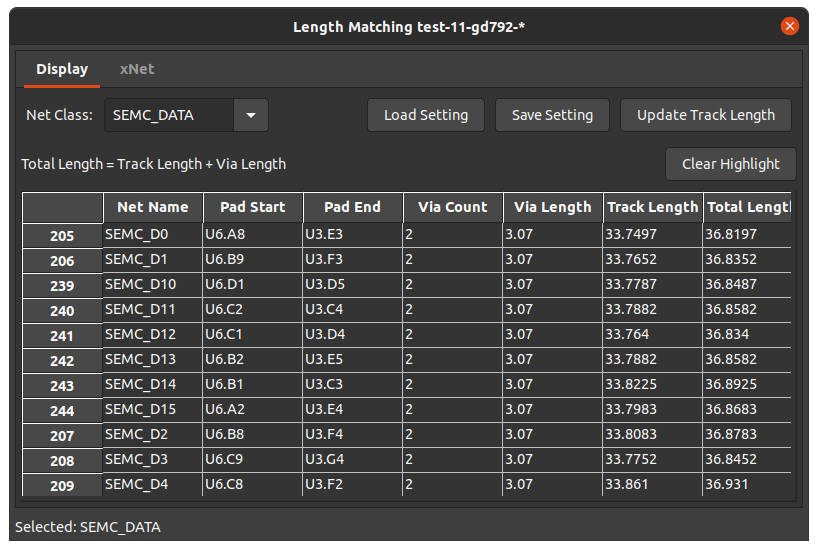
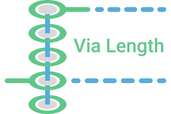

# Length Matching Plugin

## Via Length

- Image from [epiccolo.com](https://www.epiccolo.com/articles/pcb-vias-guide)
## Licence and credits
KiCad Plugin code/structure from:
- [Kicad_action_plugins](https://github.com/MitjaNemec/Kicad_action_plugins/tree/master/pad2pad_track_distance)
- [wiki.wxpython.org](https://wiki.wxpython.org/ModelViewController)
- [InteractiveHtmlBom](https://github.com/openscopeproject/InteractiveHtmlBom)
- [KiBuzzard](https://github.com/gregdavill/KiBuzzard)